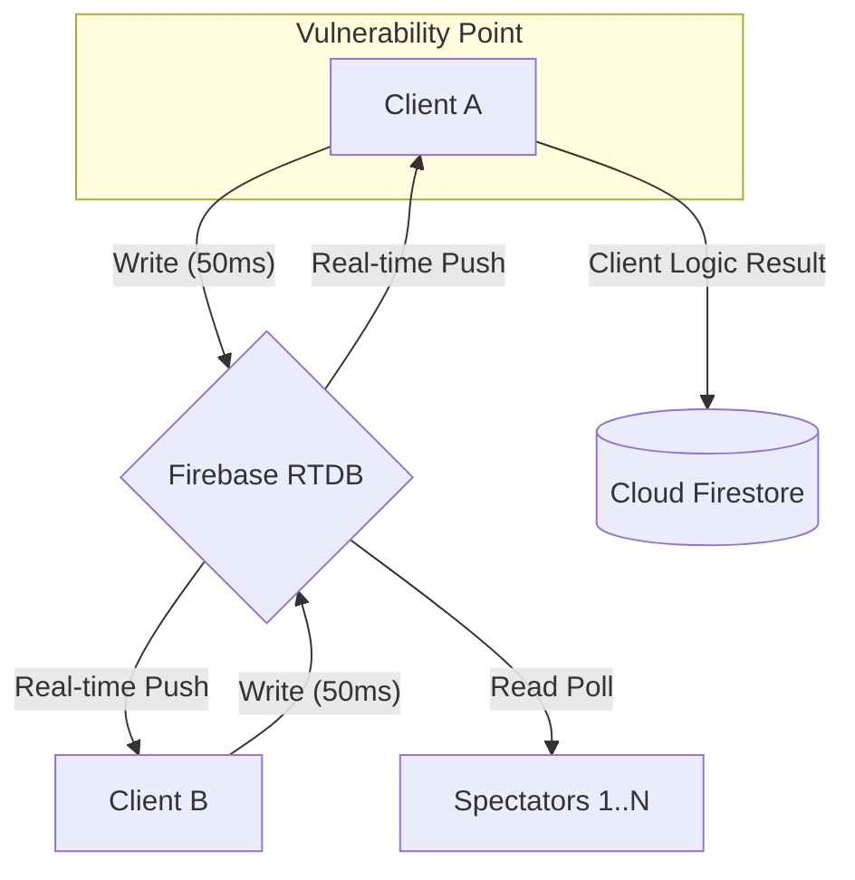

# 「TETRIS BATTLE ONLINE」設計監査レポート

**役割:** シニアゲームアーキテクト / ネットワーク・パフォーマンスエンジニア

## 1. エグゼクティブサマリー
本プロジェクトは、Vanilla JSとFirebaseを用いた高度なリアルタイムWebゲームですが、商用オンライン競技ゲームとして運用する場合、**「同期の堅牢性」「スケーラビリティ」「セキュリティ」**の3点において深刻な設計上の課題を抱えています。特に、クライアント側への全権限委譲と、非効率なデータ同期モデルは、コスト増大と不正行為の温床となるリスクがあります。

---

## 2. 危険箇所分析（深刻度順）

| 順位 | 項目 | 深刻度 | 原因 | 将来的問題 | 修正優先度 |
|:---:|:---|:---:|:---|:---|:---:|
| 1 | クライアント権限の濫用 | **最悪** | スコア、勝敗、攻撃量をクライアントが自己申告 | 不正ツールの蔓延、ランキングの形骸化 | 高 |
| 2 | 非決定論的エンジン | **致命的** | シードなし乱数、フレーム依存の重力処理 | リプレイの不一致、厳密な同期の破綻 | 高 |
| 3 | Firebase通信コスト | **警告** | 50ms毎のフル盤面送信 (秒間20回/人) | 接続数増加時の課金爆発、帯域制限 | 中 |
| 4 | 観戦者負荷の非効率性 | **警告** | 全観戦者が個別に全盤面データをRead | 人気対戦時のRead数増大 (1000人=2万Read/秒) | 中 |
| 5 | 音声エンジンのGC負荷 | **注意** | `_playNoise` におけるノードの都度生成 | 長時間プレイ時のマイクロスタッタ (FPS低下) | 低 |

---

## 3. 詳細技術解析

### ■ ゲームエンジン (Determinism)
現在の `Bag` クラスおよび `_addGarb` メソッドは `Math.random()` をシードなしで使用しています。
- **発生条件:** 常に発生。
- **問題:** 1vs1対戦で、クライアントAとBに降ってくるミノや、お邪魔ブロックの穴の位置が一致しません。これは「同じ条件下で競う」競技性を損なっています。
- **改善案:** 部屋作成時に Firebase から乱数シードを取得し、`seedable-random` を使用するように変更。

### ■ マルチプレイヤー同期 (Network & Firebase Cost)
`PUSH = 50` (50ms) 間隔で `set(ref(db, ...), game.serialize())` を実行しています。
- **データ量試算:**
  - 1パケット: 約 1.5 KB (200セルの配列 + メタデータ)
  - 1人あたりの書き込み: 1.5 KB * 20 回/秒 = 30 KB/秒
  - 4人対戦ルーム合計: 120 KB/秒 (書き込み)
  - **観戦者100名時の負荷:** 120 KB/秒 * 100 = 12 MB/秒 (読み取り)
- **将来的リスク:** Firebase RTDB の無料枠を数分で使い切り、有料枠でも数千人規模の運用は月額コストが数百万〜数千万円に達する可能性があります。

### ■ セキュリティ (Anti-Cheat)
`endGame` 関数にて `saveMultiResult` を呼び出す際、クライアント側の変数をそのまま Firestore に渡しています。
- **脆弱性:** ブラウザのコンソールから `statAtkSent = 9999; endGame(1);` と入力するだけで、誰でも世界1位になれます。

---

## 4. 可視化資料

### システムデータフロー図 (Mermaid形式)

### スケーラビリティ予測 (Firebaseコスト/負荷)

| 同時接続数 | 試合数 | 秒間 Write | 秒間 Read | 推計月額コスト (概算) |
|:---:|:---:|:---:|:---:|:---:|
| 10 | 3 | 200 | 200 | $0 (無料枠内) |
| 100 | 30 | 2,000 | 2,000 | $100 - $300 |
| 1,000 | 300 | 20,000 | 20,000 | $2,000 - $5,000 |
| 10,000 | 3,000 | 200,000 | 2,000,000 | **$50,000+ (破綻)** |

---

## 5. 最も危険な箇所 TOP 10

1. **スコア・勝敗の自己申告:** コンソールから任意の数値を送信可能。
2. **お邪魔ブロックの直接書き込み:** 相手の `garb` ノードを誰でも操作可能。
3. **フル盤面同期による通信量:** 秒間20回の 1.5KB パケット送信はコスト爆発を招く。
4. **非決定論的なミノ生成:** プレイヤー間で降ってくるミノが異なり、公平性がない。
5. **重力処理のフレーム依存:** FPS低下時にゲーム内時間が遅れる。
6. **runTransaction の乱用:** 多人数対戦時に Firebase の競合が発生し、攻撃が反映されない。
7. **管理画面のセキュリティ:** 管理者パスワードがクライアント側ソースコードにハードコードされている。
8. **メモリの断片化:** Web Audio API ノードの頻繁な生成と破棄。
9. **リスナーの累積リスク:** ルーム解散が正常に行われなかった場合の「ゴーストルーム」とリスナー残留。
10. **サーバー側バリデーションの皆無:** 異常な PPS (Piece Per Second) を検知できない。

---

## 6. アーキテクチャ改善ロードマップ

| フェーズ | 対策内容 | 期待効果 |
|:---:|:---|:---|
| **短期** | 乱数シードの同期、管理者パスワードの環境変数化 | 公平性の確保、最低限の防御 |
| **中期** | 入力同期（Input Authority）への移行、Web Worker化 | コスト 90% 削減、FPS安定化 |
| **長期** | Cloud Functions による検証、Replay/Rollback 実装 | 完全な競技性、チートの根絶 |

---

## 7. 総合評価

**本番運用適性: D (要大幅改修)**

現在の設計は「動くプロトタイプ」としては満点ですが、「オンライン対戦ゲーム」としては未成熟です。特に Firebase のコスト構造とセキュリティモデルが対戦ゲームの特性（高頻度・低遅延・高信頼）と合致していません。上記ロードマップに基づく「入力同期モデル」への転換が、商用化への唯一の道です。

---

## 結論
「TETRIS BATTLE ONLINE」は技術的デモンストレーションとしては非常に優れていますが、商用展開においては**「盤面まるごと同期」から「入力コマンド同期」へのパラダイムシフト**が不可欠です。
